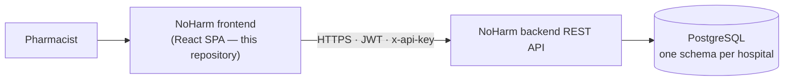

# NoHarm Frontend


[](https://github.com/noharm-ai/frontend/issues)
[](https://opensource.org/licenses/MIT)
[](https://github.com/noharm-ai/frontend/releases)

Web application for the [NoHarm](https://noharm.ai) clinical decision support
platform — an open source system that helps hospital pharmacists prevent
adverse drug events.

## Overview

A hospital produces more prescriptions every day than its pharmacy team can
read carefully. NoHarm reads them all, scores each one by risk, and puts the
dangerous ones at the top of the queue, with the specific problem flagged: a
drug–drug interaction, an allergy, a dose outside the statistical norm, a
protocol violation, a lab result that contradicts the prescription.

This repository is the interface pharmacists work in. It consumes the REST API
in [noharm-ai/backend](https://github.com/noharm-ai/backend) and holds no data
of its own.

**Who this is for**

| Audience | What they get |
|---|---|
| Clinical pharmacists and prescribers | The daily workspace: prioritize, review, intervene, record outcomes |
| Hospitals and health systems | A deployable web client, self-hosted or hosted |
| Developers | A documented React codebase to extend or adapt |

**What it does**

- **Prioritization** — risk-ordered queues of prescriptions, patients and reconciliations
- **Prescription review** — every prescribed item with its alerts, lab results and clinical notes in one screen
- **Interventions** — recording pharmacist recommendations and their outcomes
- **Medication reconciliation** — comparing prior and current medication
- **Discharge summaries** — assembling the medication plan at discharge
- **Reports** — patient-day, prescription, intervention, economy, audit and consolidated views
- **Regulation** — solicitation queues and decisions, where enabled
- **Administration** — users, roles, segments, drug curation, protocols and custom forms
- **Support and training** — ticketing, knowledge base, training modules and certificates

Available in Portuguese and English. Access is governed by per-user roles and
per-hospital feature flags, both resolved from the backend.

## Documentation

| Document | Contents |
|---|---|
| [docs/architecture.md](docs/architecture.md) | Architecture and diagrams: stack, layout, data flow, authentication, permissions, routing, conventions |
| [docs/installation.md](docs/installation.md) | Prerequisites, setup, scripts, environment variable reference, troubleshooting |
| [docs/user-guide.md](docs/user-guide.md) | What each screen does, for end users, with an FAQ |
| [docs/testing.md](docs/testing.md) | The two Playwright suites — running them and writing tests |
| [docs/deployment.md](docs/deployment.md) | Building, hosting, CI/CD, release checklist, rollback |
| [CONTRIBUTING.md](CONTRIBUTING.md) | How to fork, patch, test and submit changes |
| [CHANGELOG.md](CHANGELOG.md) | Versioning scheme and release notes |
| [SECURITY.md](SECURITY.md) | Reporting a vulnerability |
| [CODE_OF_CONDUCT.md](CODE_OF_CONDUCT.md) | Community standards |
| [docs/README.md](docs/README.md) | Documentation index |

## Technology stack

| Concern | Technology | Version |
|---|---|---|
| Runtime | Node.js (build only) | 22.x |
| UI library | React | 19.3 |
| Build tool | Vite | 8.2 |
| Language | TypeScript / JavaScript | 5.7 |
| State | Redux Toolkit + redux-persist | 2.12 |
| Components | Ant Design | 6.6 |
| Styling | Styled Components | 6.5 |
| Forms | Formik + Yup | 2.4 / 1.7 |
| HTTP | Axios | 1.20 |
| i18n | react-i18next (pt, en) | 11.18 |
| Routing | React Router | 7.18 |
| Charts | ECharts | 6.1 |
| Rich text | TipTap + DOMPurify | 3.31 / 3.4 |
| End-to-end tests | Playwright | 1.62 |
| Lint | ESLint | 9.39 |

Exact pinned versions are in [`package.json`](package.json).

## Architecture at a glance



```
src/
├── features/     # Feature modules — a Redux Toolkit slice plus its components
├── pages/        # Full-page route components
├── components/   # Shared presentational components
├── containers/   # Legacy Redux-connected components
├── store/ducks/  # Legacy reducers by domain
├── services/     # Axios calls (api.js is the entry point)
├── routes/       # Route definitions
├── models/       # Enums, permission / feature / role constants
├── translations/ # pt.json, en.json
└── styles/       # Theme, colors, breakpoints
```

New work goes in `features/`; `containers/` and `store/ducks/` are legacy and
migrated opportunistically. The full picture — authentication, token refresh,
permission and feature gating, routing — is in
[docs/architecture.md](docs/architecture.md).

## Quick start

```bash
git clone https://github.com/noharm-ai/frontend.git
cd frontend

npm ci
cp .env.sample .env      # set VITE_APP_API_URL to your backend

npm run dev              # http://localhost:3000
```

Requires Node.js 22 and a reachable [NoHarm
backend](https://github.com/noharm-ai/backend). The mocked test suite runs the
whole application with no backend at all — see
[docs/testing.md](docs/testing.md).

Full setup, including the complete environment variable reference:
[docs/installation.md](docs/installation.md).

## Scripts

| Command | What it does |
|---|---|
| `npm run dev` | Vite dev server on port 3000 |
| `npm run build` | Type-check and build into `dist/` |
| `npm run preview` | Serve the built bundle locally |
| `npm run lint` | ESLint |
| `make e2e-mock` | Playwright suite against a mocked backend — seconds, no Docker |
| `make e2e` | Playwright suite against a real backend in Docker |

## Testing

Two Playwright suites: a **mocked** one that intercepts every request and runs
in seconds on every pull request, and a **real-backend** one that runs the
actual API and database in Docker as the integration safety net. Both are
described in [docs/testing.md](docs/testing.md).

## Deployment

`npm run build` produces a static bundle in `dist/`, which is served from object
storage behind a CDN (or any static web server with SPA fallback). Environment
variables are inlined at build time, so a build is specific to one environment —
and nothing secret may ever be a `VITE_*` variable.

See [docs/deployment.md](docs/deployment.md).

## Contributing

Contributions are welcome. Branch from `develop`, follow the conventions in
[CONTRIBUTING.md](CONTRIBUTING.md) — named exports, one component per folder,
all text through i18next, new state in `features/` — run `npm run lint`,
`npm run build` and `make e2e-mock`, and open a pull request against `develop`.

**No real patient, user or credential data may ever be committed**, in code,
tests, fixtures, commit messages or screenshots.

Please read the [Code of Conduct](CODE_OF_CONDUCT.md) before participating, and
[SECURITY.md](SECURITY.md) before reporting anything security-related.

## Related repositories

| Repository | Contents |
|---|---|
| [noharm-ai/backend](https://github.com/noharm-ai/backend) | REST API |
| [noharm-ai/database](https://github.com/noharm-ai/database) | PostgreSQL schema and seed data |

## Releases

Versions follow `MAJOR.MINOR.PATCH` and are released together with the backend.
Notes for every version are on the
[releases page](https://github.com/noharm-ai/frontend/releases); the versioning
policy is in [CHANGELOG.md](CHANGELOG.md).

## License

[MIT](LICENSE) — free to use, modify, self-host and redistribute, including
commercially, with attribution.
