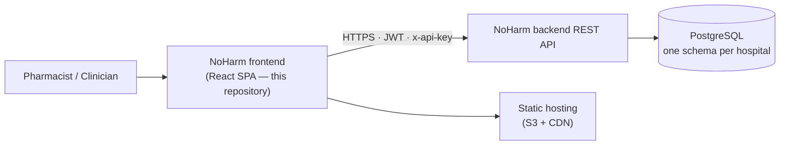
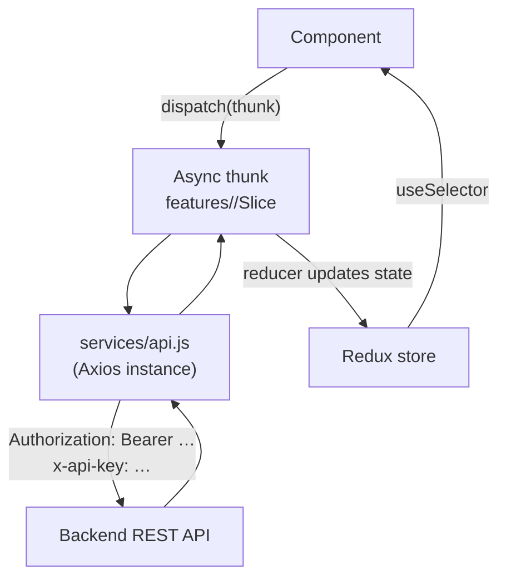
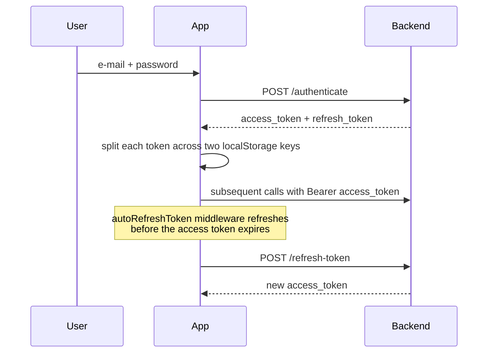
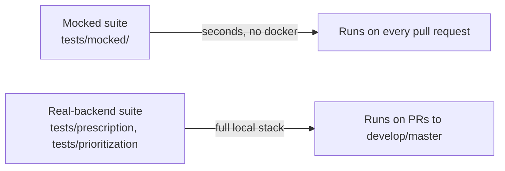

# Architecture

How the NoHarm web application is structured: the layers, how state and data
flow, how authentication and authorization work, and how a new feature is
expected to be organized.

Written for a developer who has never opened this codebase.

## 1. System context

This repository is the browser client. It holds no data of its own — every
clinical fact it displays comes from the [NoHarm
backend](https://github.com/noharm-ai/backend).



The application is a single-page app: a static bundle served from object
storage, which then talks to the API from the browser. There is no server-side
rendering and no application server of our own.

## 2. Technology stack

| Concern | Choice |
|---|---|
| UI library | React 19 |
| Build tool | Vite 8 (dev server, bundling) |
| Language | JavaScript and TypeScript side by side (`.jsx` and `.tsx`) |
| Global state | Redux Toolkit + `redux-persist`; legacy slices use the ducks pattern with `reduxsauce` |
| Component library | Ant Design 6 |
| Styling | Styled Components 6, with design tokens in `src/styles/` |
| Forms and validation | Formik + Yup |
| HTTP | Axios, one configured instance |
| Internationalization | i18next / react-i18next — Portuguese (pt) and English (en) |
| Charts | ECharts |
| Rich text | TipTap, sanitized with DOMPurify |
| Routing | React Router 7 |
| End-to-end tests | Playwright |
| Lint | ESLint 9 (flat config) |

## 3. Directory layout

```
src/
├── features/       # Feature modules — a Redux Toolkit slice plus its components
├── pages/          # Full-page route components
├── components/     # Shared, reusable presentational components
├── containers/     # Legacy smart components connected to Redux
├── store/
│   └── ducks/      # Legacy Redux reducers by domain (auth, prescriptions, drugs, …)
├── services/       # Axios calls — api.js is the main entry point
├── routes/         # Every route definition (routes.jsx)
├── models/         # Enums and permission / feature / role constants
├── hooks/          # Shared React hooks
├── lib/            # Cross-cutting helpers (withAuth, journey selection)
├── styles/         # Theme, colors, breakpoints, global CSS
├── translations/   # pt.json, en.json
├── utils/          # Formatting, storage, general helpers
└── workers/        # Web workers
```

Path aliases (declared in both `vite.config.ts` and `tsconfig.app.json`):
`src`, `assets`, `components`, `containers`, `features`, `hooks`, `lib`,
`models`, `pages`, `routes`, `services`, `store`, `styles`, `translations`,
`utils`. Import `features/prescription/...`, never `../../../features/...`.

### Two generations of code

The codebase contains an older and a newer pattern, and both are in active use:

| | Legacy | Current |
|---|---|---|
| State | `store/ducks/<domain>` (reduxsauce) | `features/<domain>/<domain>Slice.ts` (Redux Toolkit) |
| Components | `containers/` connected with `connect()` | Components inside `features/`, using hooks |

**New work goes in `features/`.** Existing ducks are migrated opportunistically,
not in bulk. Do not add to `containers/` or `store/ducks/`.

## 4. Data flow



- **One Axios instance.** `src/services/api.js` sets `baseURL` from
  `VITE_APP_API_URL` and centralizes the endpoint map. Admin, reports and
  regulation have their own service modules alongside it. Components never call
  `axios` directly.
- **The token is attached by the service layer**, not by individual callers.
- **`redux-persist`** keeps parts of the store in `localStorage`, so a reload
  does not lose the session or the user's filters.
- **The response envelope** (`{status, data}`) is unwrapped in the service /
  thunk layer; components see plain data.

## 5. Authentication and session handling



Specifics worth knowing before touching auth code:

- The access token is stored split across the `localStorage` keys `ac1` and
  `ac2`; the refresh token across `rt1` and `rt2`.
- The `autoRefreshToken` Redux middleware refreshes proactively, before
  expiration, so an active user is never interrupted.
- Every route is wrapped in the `WithAuth` higher-order component
  (`src/lib/withAuth.jsx`), which redirects unauthenticated users to `/login`.
- Requests also carry `x-api-key` from `VITE_APP_API_KEY` — this identifies the
  application to the API gateway; it is not a user credential.
- Instances configured for OAuth go through `/login/:schema` and
  `/login-callback/:schema`.
- Users belonging to more than one organization use `/switch-schema`, which
  exchanges the token for one bound to the other tenant.

## 6. Permissions and features

Two independent gates decide what a user sees:

| Gate | Source | Question it answers |
|---|---|---|
| **Permissions** | `models/Permission.js`, `services/PermissionService.js` | May *this user* do it? Derived from the roles the backend returns. |
| **Features** | `models/Feature.js`, `services/FeatureService.ts` | Did *this hospital* enable the capability at all? |

Both are resolved from data the backend puts in the session, so the client never
decides on its own what a user may do — it only avoids rendering what the
backend would reject. Hiding a control is a usability measure; the API enforces
the rule.

## 7. Routing

All routes are declared in `src/routes/routes.jsx`, grouped by area:

| Area | Example paths |
|---|---|
| Public | `/login`, `/login/:schema`, `/reset/:token`, `/validar-certificado` |
| Prioritization | `/priorizacao/prescricoes`, `/priorizacao/pacientes`, `/priorizacao/conciliacoes` |
| Clinical work | `/prescricao/:slug`, `/conciliacao/:slug`, `/prescricao/evolucao/:admissionNumber` |
| Medication | `/medicamentos/...`, `/painel-medicamentos/...` |
| Outcomes | `/intervencoes`, `/sumario-alta/...` |
| Reports | `/relatorios`, `/relatorios/...` |
| Settings | `/configuracoes/usuario`, `/configuracoes/administracao`, `/configuracoes/memoria` |
| Administration | `/admin/...` |
| Support and training | `/suporte`, `/treinamento` |

Route paths are in Portuguese because the product's primary market is Brazil;
the interface itself is translated (pt / en).

`lib/chooseJourney` selects the landing experience for a user based on the
features their organization has enabled.

## 8. Internationalization

All user-facing text goes through i18next. `src/translations/pt.json` and
`en.json` hold the keys; components call `t("namespace.key")` and never hard-code
a string. Portuguese is the reference language — add the key to both files when
you introduce one.

## 9. Adding a feature

1. Create `src/features/<domain>/` with a Redux Toolkit slice and its
   components.
2. Add the API calls to `src/services/` (or a new module there).
3. Add the page under `src/pages/<Page>/` and register the route in
   `src/routes/routes.jsx`.
4. Gate it with the appropriate permission and, if the capability is optional,
   a feature flag.
5. Add the translation keys to `pt.json` and `en.json`.
6. Cover the flow in the mocked Playwright suite (`tests/mocked/`).

Conventions enforced in review:

- **Named exports only** — no default exports.
- **One component per folder, named after the folder** —
  `TestComponent/TestComponent.tsx`, never `index.tsx`.
- **Styled Components for styling**, Ant Design for structure and layout.
- **Theme tokens** from `styles/theme.js` and `styles/colors.js` rather than
  literal colors.

## 10. Testing strategy



- The **mocked suite** intercepts every backend route, so it runs in seconds and
  can reproduce states that are impractical to seed — errors, empty states,
  permission combinations.
- The **real-backend suite** runs the actual backend and PostgreSQL in Docker
  and is the integration safety net.

Details in [testing.md](testing.md).

## 11. Build output

`npm run build` type-checks with `tsc -b` and produces a static bundle in
`dist/`. Environment variables are inlined at **build time**, which means:

- A deployment is per-environment: the same bundle cannot be repointed at a
  different API afterwards.
- Never put a secret in a `VITE_*` variable. Everything in the bundle is public
  to anyone who opens the browser's developer tools.

See [deployment.md](deployment.md).
