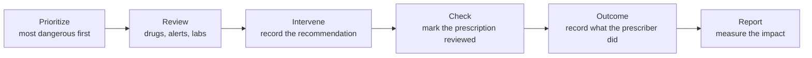

# User guide

This guide describes what the NoHarm web application does, screen by screen. It
is written for the people who use it — clinical pharmacists, prescribers,
pharmacy managers and the administrators who configure it.

The interface is available in Portuguese and English. Screenshots are
deliberately omitted: the interface changes with every release, and what a given
user sees depends on their role and on the features their hospital has enabled.

## 1. What the system is for

A hospital produces more prescriptions every day than a pharmacy team can read
carefully. NoHarm reads them all and ranks them, so the team spends its time
where the risk is.

The daily cycle:

## 2. Signing in

Open the address your hospital provided and sign in with your e-mail and
password. Hospitals using a corporate identity provider have a sign-in button
instead of the password form.

- **Forgotten password** — use the link on the sign-in screen. A reset link is
  sent to your registered address.
- **More than one organization** — if your account covers several hospitals or
  units, a *switch* option appears; choosing another organization reloads the
  application with that organization's data. You never see two organizations'
  data at once.
- **Mandatory training** — where the training module is enabled, the header
  shows how many modules you still owe and links to the Training Center.

## 3. Prioritization — your work queue

The prioritization screens are the starting point. Each row is scored by risk,
and the list is ordered so the most dangerous items come first.

| View | What it lists |
|---|---|
| **Prescriptions** | Individual prescriptions awaiting review |
| **Patients** | One row per patient-day, aggregating everything prescribed |
| **Patients (cards)** | The same data as cards, for a faster visual scan |
| **Conciliation** | Admissions awaiting medication reconciliation |
| **Outpatient** | Outpatient flows, where enabled |

What you can do here:

- **Filter** — by unit or segment, department, date, and by the presence of
  specific alerts. Filters persist between sessions.
- **Search** — by prescription number, admission number or patient, using the
  search box in the header.
- **Read the tags** — colored tags summarize why an item scored where it did:
  interaction, allergy, dose outlier, protocol, antimicrobial, and others.
- **Open an item** — click it to go to the review screen.

## 4. Reviewing a prescription

The review screen brings everything needed for one decision into one place.

| Area | Contents |
|---|---|
| **Header** | Patient, admission, unit, prescriber, and the actions available |
| **Prescribed items** | Every drug with dose, route, frequency and the alerts raised against it |
| **Alerts** | Drug–drug interactions, allergies, doses outside the statistical norm, protocol violations, culture and antimicrobial flags |
| **Solutions** | Infusion solutions and their components, where applicable |
| **Lab results** | Recent exams, with the values that matter to this prescription highlighted |
| **Clinical notes** | Notes from the record, with AI-assisted summaries where enabled |
| **Patient data** | Weight, height, allergies and observations — editable when your role allows |

Acting on an item:

- **Record an intervention** — choose a reason, add a note, and mark whether it
  represents a medication error. One intervention can be applied to several
  items at once.
- **Annotate an item** — a note that stays with the item without becoming a
  formal intervention.
- **Check the prescription** — marks it reviewed and removes it from the queue.
  Where the hospital locks checked prescriptions, only an authorized role can
  undo it.
- **Print or export** — produce a document for the record or the ward round.

## 5. Interventions and outcomes

**Interventions** lists everything the team has recorded, with filters by date,
unit, reason and status.

An intervention is only half the story; the other half is what the prescriber
did. Recording the **outcome** — accepted, not accepted, and the resulting cost
avoided where applicable — is what feeds the economy and effectiveness reports.
Outcome forms are opened from the intervention list.

## 6. Conciliation

Medication reconciliation compares what the patient was taking before admission
with what is prescribed now, so nothing is unintentionally continued, stopped or
duplicated. Available when the hospital has the conciliation feature enabled.

## 7. Discharge summary

Where enabled, the discharge summary screen assembles the medication plan and
clinical narrative for a patient's discharge, using the data already in the
system and AI-assisted drafting. The draft is always reviewed by a human before
it is used.

## 8. Medications

- **Medications** — the drug catalog for a segment: attributes, dose limits,
  frequencies and the statistical outlier ranges that drive alerts.
- **Medication panel** — a dashboard view of the same data, for curation and
  review.

Editing here changes how alerts behave for the whole organization, so it
requires a configuration or curation role.

## 9. Reports

| Report | Answers |
|---|---|
| **Patient-day** | How many patient-days were reviewed, and by whom |
| **Prescriptions** | Volume and composition of what was reviewed |
| **Interventions** | What the team recommended, and what came of it |
| **Economy** | Cost avoided, from accepted interventions |
| **Audit** | Who did what, and when |
| **Consolidated** | The same reports aggregated across units or periods |
| **Regulation indicators** | Regulatory workflow indicators, where enabled |

Reports can be exported for use outside the system. Large reports are generated
in the background; the screen tells you when the file is ready.

## 10. Regulation

Where the regulation feature is enabled, this area handles solicitations —
requests that need authorization before they proceed — with their own queue,
risk scoring and decision workflow.

## 11. Settings and administration

| Area | Who uses it | What it covers |
|---|---|---|
| **User settings** | Everyone | Your own profile, password and preferences |
| **Registration** | User administrators | Creating and editing users, assigning roles, password resets |
| **Custom forms** | Configuration administrators | Data collection forms tailored to the hospital |
| **Memory** | Configuration administrators | Stored configuration records — texts, options, defaults |
| **Administration** | Administrators | Segments, exams, routes, tags, protocols, schedules, integration status and drug curation |

Roles determine what appears. The main ones:

| Role | Purpose |
|---|---|
| Prescription Analyst | Prioritize and analyze prescriptions; all prescription actions |
| Configuration Administrator | Curate medication, score and exam configuration |
| User Administrator | Register and edit the organization's users |
| Dispensing Manager | Manage dispensing information |
| Discharge Manager | Produce discharge summaries |
| Regulator | Handle regulatory solicitations |
| Viewer | Read-only access to prescriptions |
| Support Requester / Support Manager | Open and manage support tickets |

Hiding a control is a convenience; the API enforces the same rules
independently, so nothing can be reached by guessing a URL.

## 12. Support Center and Training

- **Support Center** — open a ticket, follow its progress, and search the
  knowledge base.
- **Training Center** — required and optional training modules, with progress
  tracking and certificates. Certificates carry a code that anyone can check on
  the public certificate validation page without signing in.

## 13. FAQ

**A menu item other people have is missing for me.**
Either your role does not include it or your hospital has not enabled that
feature. Your user administrator can check both.

**Why is a low-risk prescription ranked above a high-risk one?**
The score combines many factors — interactions, dose outliers, patient
condition, lab results, protocols. Open the item and read its tags; they explain
the ranking.

**I checked a prescription by mistake.**
Uncheck it if your role allows. Where the hospital locks checked prescriptions,
an authorized colleague has to do it — the lock is deliberate, so that a
reviewed prescription is not silently reopened.

**Can I see another unit's or another hospital's data?**
Only if your account was granted access to it. Data is isolated per
organization, and per unit within an organization.

**The interface is in Portuguese and I want English.**
Both languages ship with the application; switch language in your user settings.

**I found what looks like wrong clinical content — a wrong interaction or dose
range.**
Report it to your pharmacy team; drug configuration is curated per hospital and
they can correct it. If it looks like a problem in the software itself, it can
be reported at <https://github.com/noharm-ai/frontend/issues>.

**Does the system decide for me?**
No. NoHarm ranks, flags and drafts. Every clinical decision — including
accepting an AI-assisted summary — is made and recorded by a professional.

**Where do I report a security or privacy problem?**
Not in a public issue. Follow [SECURITY.md](../SECURITY.md).
